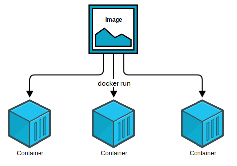
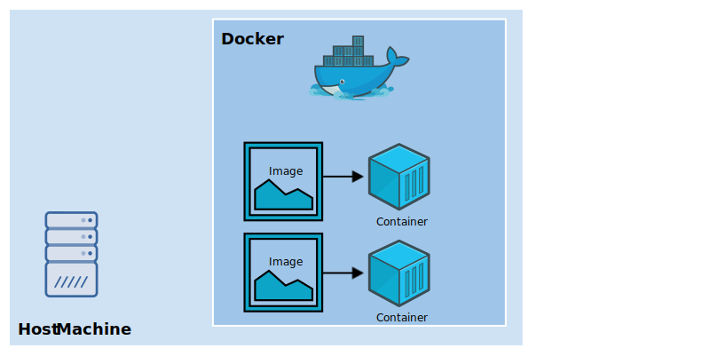
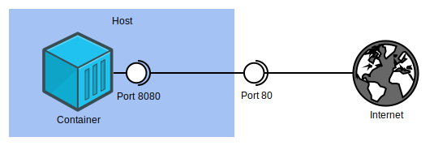
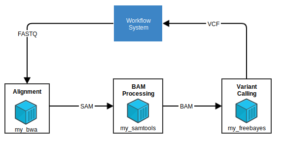





class: split-20 nopadding
background-image: url(../key.jpg)

.column_t2.center[.vmiddle[
.fgtransparent[

]
]]
.column_t2[.vmiddle.nopadding[
.shadelight[.boxtitle1[
.small[
## Acknowledgements

#### Melbourne Bioinformatics

- [Tutorials and protocols](https://www.melbournebioinformatics.org.au/tutorials/)
]]]
]]

.footer.small[
- #### Slides are created according to sources in the literature & Acknowledgements
]
 
---

name: content

# Content

- [Docker and Containers](#part1)
- [Running Containers](#part2)
- [Making your Own Image](#part3)
- [Docker on HPC](#part4)

---
name: part1
class: center, middle, inverse

# Docker and Containers


---
layout: true

.section[[Docker and Containers](#content)]

---
## Containerization
* Containerization is any system that allows multiple isolated operating systems to run inside a larger, host system
* The most basic type of containerization is `chroot`, which runs an application in a *jail* where it cannot see or access anything outside of its jail
* The most popular and well supported system for containerization is Docker, which will be the focus of this workshop


---
## What is Docker? 

> A container image is a lightweight, stand-alone, executable package of a piece of software that includes everything needed to run it: code, runtime, system tools, system libraries, settings
> — https://www.docker.com/what-container

.img-half[

]

---
## Use-cases
.medium[
* Docker is the ideal way of deploying applications such as:
    * Web applications that need a proxy server, database and application code, and a consistent
    operating environment
        * Examples: Galaxy (a bioinformatics platform), GitLab (a git host), Ghost (blogging platform)
    * Analysis pipelines or pipeline stages that require many runtimes (Python, Perl, Java etc.) and
    many tools (Samtools, GATK, VEP)
        * Examples: Pipelines written in CWL, WDL
    * Testing and continuous integration, allowing your tests to run in a consistent
    environment with a very precisely defined set of dependencies
        * Examples: Jenkins, Drone CI
    * Complex or fragile applications that would be difficult to compile locally
        * Examples: PennCNV, hap.py
]

.columns[
.column[
]
.column[


]
.column[


]

.column[


]

.column[
]
]

---
## Use-cases
* Docker is not ideal for (but can still be used for):
    * Command-line utilities or tools that manipulate files or use the filesystem
        * Examples: samtools, bwa, vim
    * Graphical/GUI applications
        * Examples: Atom (text editor), Firefox, fastqc

.columns[
.column[
]
.column[


]
.column[


]
.column[
]
]

---
## Advantages

.medium[
Distributing and using software as a Docker image gives you:
* **Bundled Dependencies** – Docker images contain all their own dependencies, which means you don’t have to do any installation yourself (compared to an application that is just source code or a .deb installer)
* **Cross-platform Installation** – Docker containers contain their own operating system, so they will run on any platform (even Windows!)
* **Easy Distribution** - Can be distributed as a single .tar image file, or put on docker hub so it can be `docker pull`'d
* **Safety** – Files in a container can’t access files on the host machine, so users can trust dockerized applications
* **Ease-of-Use** – Docker containers can always be run using one single docker run command
* **Easy Upgrades** – Docker containers can be easily swapped out for newer versions, while all persistent data can be retained in a data volume
]

---
## Docker vs VMs
* Virtual machines solve the same problem as docker, but are much less lightweight
* Virtual machines package the entire guest OS, while Docker uses the host kernel and a minimal OS that can be shared between containers

.columns[
  .column[
    
  ]
  .column[
    
  ]
]

---
## Terminology - Images and Containers
* A docker **image** is an archive containing all the data needed to run the application
* When you run an **image**, it creates a **container**, which you can start and stop and delete without it affecting the image
* You can have many containers running the same image
* You can think of a Docker image as like a class in Object-Oriented Programming, and a docker container as like an object


---

## Terminology - Host
* The **host** machine is the machine running Docker, on which images and containers are stored


---

name: part2
class: center, middle, inverse
layout: false

# Running Containers

---
layout: true

.section[[Running Containers](#content)]

---

## Docker Run
* To run a container, all you need to do is specify the image name, and docker will pull the image from Docker Hub, and begin running it 
* `docker run <IMAGE NAME>`

.message.is-info[
.message-header[
Exercise
]
.message-body[
- Run the following command. What does it output?

```bash
docker run hello-world
```
]
]
--
.message.is-success[
.message-header[
Answer
]
.message-body[
```
Hello from Docker!
This message shows that your installation appears to be working correctly.
```
]
]

---
## Docker Hub
* When you ran this command, Docker first looked for the image on your local machine, and when it couldn't find it, pulled it down from a cloud registry of Docker images called Docker Hub
* You can find an image for most applications and runtimes on Docker Hub
* You can search Docker Hub using a website called the Docker Store: <https://store.docker.com/>

.message.is-info[
.message-header[
Exercise
]
.message-body[
- Search on Docker Hub for the best docker image for the `galaxy` platform. What name would you use
if you wanted to run this container? Hint: the right one links to <https://www.galaxyproject.org/>
]
]

---
## Docker Hub
.message.is-success[
.message-header[
Answer
]
.message-body[
    
]
]

---
## Listing Images
* Images that you have installed locally can be viewed using `docker images`

.message.is-info[
.message-header[
Exercise
]
.message-body[
- Run the following command to view all images installed on your machine:
```bash
docker images
```
]
]
--
.message.is-success[
.message-header[
Answer
]
.message-body[
```
REPOSITORY          TAG                 IMAGE ID            CREATED             SIZE
hello-world         latest              f2a91732366c        3 months ago        1.85kB
```
]
]

---
## Docker Run Flags
* Docker Run is of the form:
```bash
docker run [docker options] <IMAGE NAME> [image arguments]
```
* This means that arguments that affect the way Docker runs must always go before the image name, but arguments that are passed to the image itself must go after the image name

---
## Port Mapping

.medium[
* Docker containers are free to listen on whatever ports to want to, for example port 80/443 for web requests
* However, these ports are not available on the host machine unless you use
    ```bash
    docker run -p host:container <IMAGE NAME>
    ```
* This command means "map port 8080 inside this container to port 80 on the host machine"
    ```
    docker run -p 80:8080 <IMAGE NAME>
    ``` 
* Note that the host port and container port *can be the same*, and this is quite common


]

---
## Port Mapping
.message.is-info[
.message-header[
Exercise
]
.message-body[
Run the following command to start an nginx server running on your cloud instance:
```bash
docker run -p 80:80 nginx
```
Now visit this server by typing in your cloud instance IP address into a web browser:
```
http://115.146.85.14
```
Stop the container using `Ctrl+C`, just like any process
]
]

---
## Detached Mode
* If you ever need a container to run in the background, use the `-d` docker flag. For instance, we
could have run:
```bash
docker run -d -p 80:80 nginx
```

* Docker then prints out the ID of the container, allowing you to access it later:
```
e0d19a8b903015d01a1456a8c9b2351f540b240c0f596030e1d4cd85f9d6956a
```
---
## Exercise - Galaxy
- Galaxy is a web-based platform for running bioinformatics analysis

.message.is-info[
.message-header[
Exercise
]
.message-body[
* You want to run a Galaxy server on your NeCTAR instance
* The image is called `bgruening/galaxy-stable`
* The galaxy image listens on port 80 inside the container
* You want to run the container in the background
* What is the correct `docker run` command to use?
* Once you have done this, check it was correct by visiting your instance IP address in a browser
]
]

--
.message.is-success[
.message-header[
Answer
]
.message-body[
```
docker run -d -p 80:80 bgruening/galaxy-stable
```
]
]
---
## Listing running containers
* `docker ps` lists all currently running containers
* Can also show all terminated containers with the `-a` flag
* The IDs that are shown can be useful for other docker commands like `docker stop` and `docker exec`

.message.is-info[
.message-header[
Exercise
]
.message-body[
- Try running the command:
```bash
docker ps
```
]
]

--

.message.is-success[
.message-header[
Answer
]
.message-body[
```
CONTAINER ID        IMAGE                     COMMAND              CREATED             STATUS              PORTS                                                     NAMES
e0d19a8b9030        bgruening/galaxy-stable   "/usr/bin/startup"   2 minutes ago       Up 2 minutes        21/tcp, 443/tcp, 8800/tcp, 9002/tcp, 0.0.0.0:80->80/tcp   zen_leakey```
]
]
---
# Docker Stop
* Ordinarily, you can press `ctrl+c` to stop a container currently running in your terminal
* However, if the container is running in the background (with `-d`), or refuses to close, you can use `docker stop`
```bash
docker stop <CONTAINER ID>
```

.message.is-info[
.message-header[
Exercise
]
.message-body[
* Use `docker stop` if you to close the currently running Galaxy Docker container
* Hint: use `docker ps` if you've forgotten the container's ID
]
]

---
## Volumes and Bind Mounts

.medium[
* By default, Docker containers cannot access data on the host system. This means
	* You can't use host data in your containers
	* All data stored in the container will be lost when the container exits
* You can solve this in two ways:
	* `-v /path/in/host:/path/in/container`: This **bind mounts** a host file or directory into the container. Writes to one will affect the other. Note that both paths have to be *absolute* paths, so you often want to use
```
`pwd`/some/path
```
	* `-v volume_name:/path/in/container`. This mounts a **named volume** into the container, which will live separately from the rest of your files. This is preferred, unless you need to access or edit the files from the host
]

---

## Exercise - Galaxy Logs
.message.is-info[
.message-header[
Exercise
]
.message-body[
* You need to store the logs for your Galaxy image on your host system using a bind mount
* The Galaxy container stores its logs in `/home/galaxy/logs`
* What command do you run?
* *Hint: You will want to run the container in detached mode*
* Once you have done this, `ls` the directory you mounted into the container to verify that you have the logs
]
]
--

.message.is-success[
.message-header[
Answer
]
.message-body[
```bash
docker run -d -v `pwd`/galaxy_logs:/home/galaxy/logs bgruening/galaxy-stable
```
]
]

---
## Exercise - Galaxy Logs
.message.is-info[
.message-header[
Exercise
]
.message-body[
- Now, try to stop this container the same way we did last time
]
]

---
## Running commands inside a container
* You can run a command inside a running container using:
```bash
docker exec <CONTAINER ID> <COMMAND>
```
* For example:
```bash
docker exec bd2ac6cce96f ls
```
* You can also run an interactive bash session inside the container with:
```bash
docker exec -it bd2ac6cce96f bash
```
---

## Running a Container Interactively
.message.is-info[
.message-header[
Exercise
]
.message-body[
* Start another Galaxy container using:
```bash
docker run -d -p 80:80 bgruening/galaxy-stable
```
* Now, you want to make a quick edit to the Galaxy homepage, which is located at `/etc/galaxy/web/welcome.html`
* Edit the welcome message in some way, save the file, and then check to see if your changes worked on the website
* You'll probably have to re-open the webpage in an incognito window to get it to refresh
]
]

---
## Running a Container Interactively

.message.is-warning[
.message-header[
Info
]
.message-body[
* First, `docker ps` to find the container ID
* Next, `docker exec -it <CONTAINER_ID> bash`
* Now, run `nano /etc/galaxy/web/welcome.html` (or vim!) and save the file
]
]
---
## Summary
The Docker commands we've covered so far are:
* `docker [-d] [-p host:container] [-v /host/path:/container/path] run <IMAGE NAME>`, which runs a Docker image
* `docker images`, which displays all installed images
* `docker ps [-a]`, which displays all containers on the system
* `docker exec <CONTAINER ID> <COMMAND>`, which lets you run a command inside a running container
* `docker stop <CONTAINER ID>`, which stops a running container
---

name: part3
class: center, middle, inverse
layout: false

# Making your Own Image

---
layout: true

.section[[Making your Own Image](#content)]

---
## Dockerfiles
* The core of making a Docker image is a Dockerfile
* These files should have the exact name `Dockerfile`, and should be located in their own directory
* A Dockerfile is a list of commands, a lot like a shell script, that progressively builds the image:
    * `FROM` lists the image to "inherit" from
    * `RUN` executes a shell command
    * `COPY` copies some data from the host to the image
    * `ENTRYPOINT` sets the command that will be run when a container is created
    * `WORKDIR`, like `cd`, sets the current working directory for the build script
---
## Dockerfiles - Example
```
# Start with an empty Ubuntu image
FROM ubuntu

# Install apt dependencies
RUN apt-get update && apt-get install -y curl make build-essential libssl-dev 

# Copy in the repository
COPY . /opt/cpipe

# Move into the cpipe dir
WORKDIR /opt/cpipe

# Run the install script
RUN ./install.sh --noninteractive

# Run the main script
ENTRYPOINT ["./cpipe"]
```
---
## Dockerfile Tips
* You should try to separate the Dockerfile into as many stages as possible, because this will allow for better caching
* `apt-get`:
	* You must run `apt-get update` and `apt-get install` in the same command, otherwise you will encounter caching issues
	* Remember to use `apt-get install -y`, because you will have no control over the process while it's building
* Useful resources:
	* [Dockerfile reference](https://docs.docker.com/engine/reference/builder/)
	* [Best practices](https://docs.docker.com/engine/userguide/eng-image/dockerfile_best-practices/)
---
## Docker Build
* To build a Docker image from a Dockerfile, use the `docker build` command
* You should specify an image tag/name using `-t`, and a directory containing the Dockerfile. For example:
```bash
docker build -t my_image .
```
---
## Exercise - Dockerizing Samtools
* Samtools is a common utility for working with SAM and BAM alignment files
* Samtools can be installed using `apt-get install samtools`

.message.is-info[
.message-header[
Exercise
]
.message-body[
* Create a Dockerfile for samtools inside its own directory, and build it using `docker build`
* Make sure you tag it as `my_samtools`, we'll need it later on
* You'll also need to set the entrypoint to the `samtools` command
* Once it's finished, try testing it using the SAM file provided:

```bash
docker run -i my_samtools view -S -H - < data/alignment.sam
```
]
]

---
## Exercise - Dockerizing Samtools
.message.is-success[
.message-header[
Solution
]
.message-body[
- `my_samtools/Dockerfile`:
```
FROM ubuntu
RUN apt-get update && apt-get install -y samtools
ENTRYPOINT ["samtools"]
```
- Building:
```bash
docker build -t my_samtools my_samtools/
```
]
]

---
## Exercise - Dockerizing BWA
* bwa can be installed in much the same way as samtools

.message.is-info[
.message-header[
Exercise
]
.message-body[
* Try making a Dockerfile for `bwa`
* Make sure you tag this as `my_bwa`
* The image is probably working if it prints out the `bwa` help when you run the image
]
]

--

.message.is-success[
.message-header[
Exercise
]
.message-body[
```
FROM ubuntu
RUN apt-get update && apt-get install -y bwa
ENTRYPOINT ["bwa"]
```
]
]

---
## Exercise - Dockerizing Freebayes
* Freebayes is an open-source variant caller (calculates how a given individual's DNA differs from a reference genome)
* Freebayes is a little harder to install - you'll need to build it from source
* Installation instructions for Freebayes can be found here: https://github.com/ekg/freebayes#obtaining

.message.is-info[
.message-header[
Exercise
]
.message-body[
* Try making a Dockerfile for `freebayes`
* As a tip, the apt-get repositories you need for this will be: `git build-essential zlib1g-dev libbz2-dev liblzma-dev`
* Make sure you tag this as `my_freebayes`
]
]

---
## Exercise - Dockerizing Freebayes
.message.is-success[
.message-header[
Solution
]
.message-body[
```
FROM ubuntu
RUN apt-get update && apt-get install -y git build-essential zlib1g-dev libbz2-dev liblzma-dev
WORKDIR /tmp
RUN git clone --recursive git://github.com/ekg/freebayes.git
WORKDIR freebayes
RUN make 
RUN make install
ENTRYPOINT ["freebayes"]
```
]
]

---
## Dockerized Pipelines
* Docker containers are often used to provide the tools and runtime environment for each stage in a bioinformatics pipeline
* A number of workflow frameworks support Docker:
	* Broad's WDL
	* CWL (Common Workflow Language)
	* Galaxy



---
## Dockerized Pipelines
Conveniently, the images you just make are just the right ones for running a variant calling pipeline
.message.is-info[
.message-header[
Exercise
]
.message-body[
- Try running 
```bash
cwltool cwl_workflow/workflow.cwl \
	--read_1 data/NA12878_CARDIACM_MUTATED_L001_R1.fastq.gz \
	--read_2 data/NA12878_CARDIACM_MUTATED_L001_R2.fastq.gz \
	--reference data/ucsc.hg19.fasta
```
]
]

And while that's running, we'll move onto the next topic...
---

name: part4
class: center, middle, inverse
layout: false

# Docker on HPC

---
layout: true

.section[[Docker on HPC](#content)]

---
## Docker on HPC
* Security on HPC:
	* If you have Docker access, you effectively have `root` permissions over the entire operating system
	* This works fine on the cloud, where instances are rarely shared between multiple users
	* However on HPC (computing clusters etc), this would allow Docker users to access each other's files
	* For this reason, it is unlikely you will find Docker installed on an HPC system
* Two main alternatives exist for running containers on HPC:
	* [Shifter](https://github.com/NERSC/shifter) - Generally uses the same API as Docker, but with some key missing features like writeable containers. Not actively developed.
	* [Singularity](http://singularity.lbl.gov/) - A ground-up reimplementation of Docker, with a fairly different CLI. Actively developed.
---
## Converting a Docker Image
* Unlike Docker, Singularity stores its images as individual files
* You can convert a docker image to a singularity image using a docker container:
```bash
docker run \
    -v /var/run/docker.sock:/var/run/docker.sock \
    -v [OUTPUT DIRECTORY]:/output \
    --privileged \
    -t --rm \
    singularityware/docker2singularity \
	[IMAGE NAME]
```

.message.is-info[
.message-header[
Exercise
]
.message-body[
- Using the command above, try creating a singularity image from your `my_samtools` image
]
]

---
## Running a Singularity Image
.message.is-info[
.message-header[
Exercise
]
.message-body[
- Test out that your singularity image works properly using:
```bash
singularity run [IMAGE FILE] view -HS - < data/alignment.sam
```
]
]

---

name: end
class: center, middle
layout: false

# That's All 👨🏻‍🎓
# Thank you for listening!

--

class: center, middle, theend, hide-text
layout: false
background-image: url(../theend.gif)

