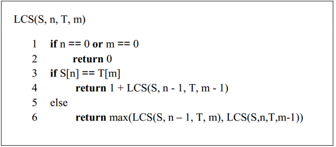
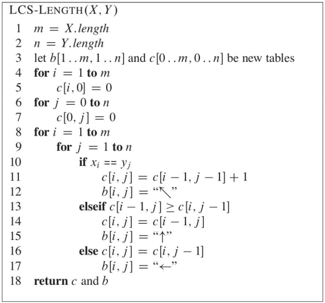
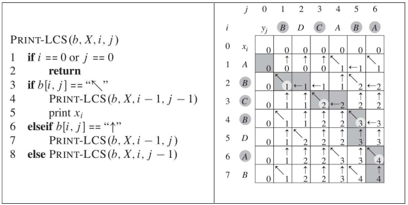




class: split-20 nopadding
background-image: url(../key.jpg)

.column_t2.center[.vmiddle[
.fgtransparent[

]
]]
.column_t2[.vmiddle.nopadding[
.shadelight[.boxtitle1[
.small[
## Acknowledgements

#### University of Novi Sad | Serbia

- [Doc. dr Ivan Kaštelan](http://www.rt-rk.uns.ac.rs/nastavno-osoblje/doc-dr-ivan-kaštelan)
- [Faculty of Technical Sciences](http://ftn.uns.ac.rs/)
- [Sub-department for Computer Engineering and Computer Communications](http://www.rt-rk.uns.ac.rs)
]]]
]]

.footer.small[
- #### Slides are created according to sources in the literature & Acknowledgements
]
 
---

name: zadaci
name: uvod 
class: center, middle, inverse

# Zadaci

---
layout: true

.section[[Zadaci](#sadrzaj)]

---

## Zadatak 1 

.message.is-info[
.message-header[
Zadatak
]
.message-body[
- Implementirati rešenje problema nalaženja najdužeg zajedničkog podniza. 
- Analizirati vreme izvršavanja i iscrtati grafik.

]
]

---
## Zadatak 2

.message.is-info[
.message-header[
Zadatak
]
.message-body[
- Implementirati rešenje problema nalaženja najdužeg zajedničkog podniza upotrebom dinamičkog programiranja. 
- Analizirati vreme izvršavanja i iscrtati grafik. Pseudokod algoritam je dat na slici.

]
]

---
## Zadatak 3

.message.is-info[
.message-header[
Zadatak
]
.message-body[
- Implemetirati iscrtavanje nalaženja najdužeg zajedničkog podniza upotrebom dinamičkog programiranja iz zadatka 2. 
- Pseudokod algoritma je dat na slici.
  
]
]

--
.message.is-success[
.message-header[
Odgovor
]
.message-body[
- <a target="_blank" rel="noopener noreferrer" href="../python-z12-resenja"> ☛ `Rešenja`</a>
]
]

---

class: center, middle, theend, hide-text
layout: false
background-image: url(../theend.gif)

