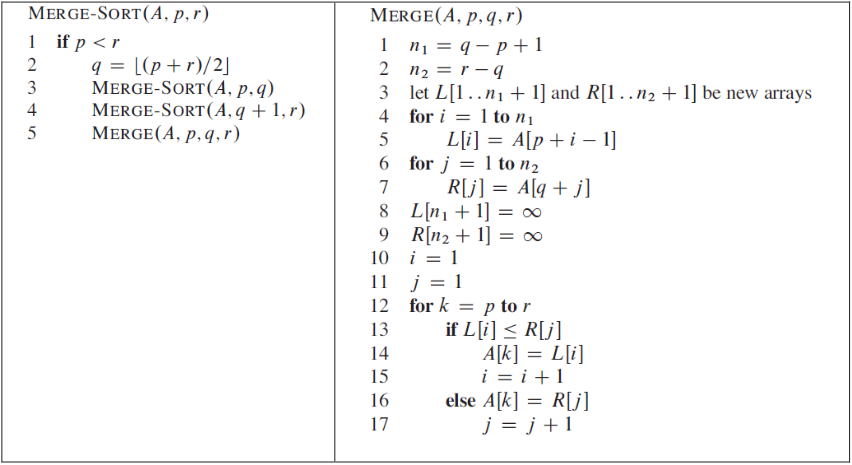
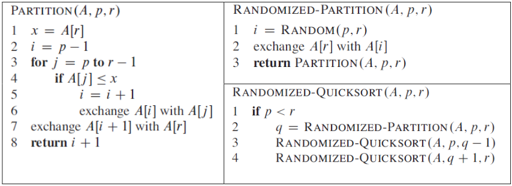




class: split-20 nopadding
background-image: url(../key.jpg)

.column_t2.center[.vmiddle[
.fgtransparent[

]
]]
.column_t2[.vmiddle.nopadding[
.shadelight[.boxtitle1[
.small[
## Acknowledgements

#### University of Novi Sad | Serbia

- [Doc. dr Ivan Kaštelan](http://www.rt-rk.uns.ac.rs/nastavno-osoblje/doc-dr-ivan-kaštelan)
- [Faculty of Technical Sciences](http://ftn.uns.ac.rs/)
- [Sub-department for Computer Engineering and Computer Communications](http://www.rt-rk.uns.ac.rs)
]]]
]]

.footer.small[
- #### Slides are created according to sources in the literature & Acknowledgements
]
 
---
name: zadaci
name: uvod 
class: center, middle, inverse

# Zadaci

---
layout: true

.section[[Zadaci](#sadrzaj)]

---

## Zadatak 1

.message.is-info[
.message-header[
Zadatak
]
.message-body[
- Implementirati Merge-sort algoritam, proveriti njegovu funkcionalnost i analizirati vreme izvršenja. Pseudokodovi algoritma i pomoćnih funkcija su prikazani na slici.

]
]

---
## Zadatak 2

.message.is-info[
.message-header[
Zadatak
]
.message-body[
- Implementirati `Quicksort` algoritam, proveriti njegovu funkcionalnost i analizirati vreme izvršenja. Pseudokodovi algoritma i pomoćnih funkcija su prikazani na slici.

]
]

---

## Napomene:

.message.is-warning[
.message-header[
Info
]
.message-body[
- Ulazni podaci su celobrojne vrednosti organizovane u listu.
- Funkcionalnost algoritma proveriti na malom broju ulaznih podatka.
- Tokom analize vremena izvršenja algoritma koristiti različite veličine ulaznih podataka.
]
]

--
.message.is-success[
.message-header[
Odgovor
]
.message-body[
- <a target="_blank" rel="noopener noreferrer" href="../python-z3-resenja"> ☛ `Rešenja`</a>
]
]

---

class: center, middle, theend, hide-text
layout: false
background-image: url(../theend.gif)

